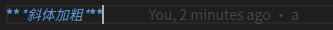

## 今日目标
  
1. ### 熟练使用Markdown


Markdown是一种可以使用普通文本编辑器编写的标记语言，通过简单的标记语法，它可以使普通文本内容具有一定的格式。

### 优点:

1. 因为是纯文本，只要支持Markdown的地方都能获得一样的编辑效果

2 .操作简单。

### 缺点:

1. 需要记一些语法。

2. 有些平台不支持Markdown编辑模式。

    ````

*斜体*

**加粗**  

***斜体加粗***



[百度](https://www.baidu.com)

使用`:-`表格左对齐
使用`:-:`表格居中
使用`-:`表格右对齐

姓名|年龄|性别
:-|:-:|-:
张三|18|女

``删除线``

>引用

>>引用可以多层嵌套

```代码
块```

````


